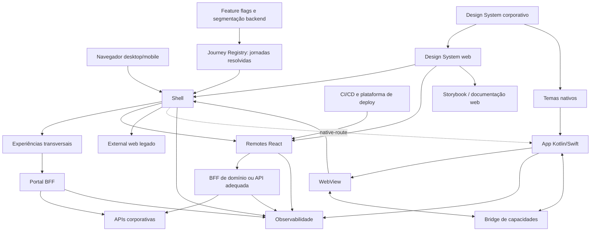

# Architecture

## Context and Drivers

O Portal Pessoas deve sustentar mais de 10 squads, aplicações web e mobile, entregas independentes, integração temporária com sistemas legados e inclusão de domínios sem alteração recorrente do shell.

Autonomia sustentável é o principal direcionador, equilibrado com performance, consistência, segurança, governança e operação. A arquitetura cobre `FR-1`, `FR-5`, `FR-6` e `FR-8–FR-15` de `docs/SPEC.md` e as fronteiras de responsabilidade definidas em `docs/specs/parte-2-legado-rollout-resiliencia.md`.

## Technology Baseline

| Concern | Decision | Role and constraint |
|---|---|---|
| UI | React e TypeScript | Baseline das aplicações web modernas |
| Rendering | CSR/SPA | Portal autenticado sem necessidade de SEO ou SSR |
| Workspace | Nx e pnpm | Grafo, cache, projetos afetados, generators e fronteiras |
| Build | Vite | Build e desenvolvimento do shell e dos remotes |
| Serviços de plataforma | Node.js 24 e Fastify | Serviços/BFFs mantidos pela Plataforma Frontend, sem regras de negócio corporativas |
| Build server-side | Nx esbuild e `@nx/js:node` | Artefatos Node ESM e execução local com watch |
| Composition | Module Federation Runtime | Carregamento independente e dinâmico por rota |
| Routing | React Router | Shell controla rotas principais; domínio controla rotas relativas |
| HTTP | `fetch` e clientes por domínio | Sem cliente global contendo endpoints de negócio |
| Server state | TanStack Query | Uma instância e um cache por domínio |
| Client state | React; Zustand quando justificado | Stores sempre restritos ao domínio |
| Forms | React Hook Form e Zod | Estado local e validação de apresentação |
| Styling | CSS Modules, SCSS e CSS Custom Properties | Tokens dinâmicos e seletores isolados |
| Design System docs | Storybook | Documentação executável dos componentes web |
| Tests | Vitest, Testing Library, MSW e Playwright | Validação proporcional ao risco |
| Observability | Contrato próprio e propagação W3C | Backend compatível com OpenTelemetry; frontend desacoplado de fornecedor |

Versões concretas serão fixadas no lockfile no início da Parte 2.

## Architectural Style and Boundaries

O portal adota monorepo para o frontend moderno e serviços server-side mantidos pela Plataforma Frontend, com microfrontends coarse-grained compostos em runtime.

O shell possui bootstrap, navegação, contexto de plataforma, descoberta, composição, loading, fallback e observabilidade transversal. Não possui regras, estado ou orquestração de APIs de negócio, nem decide público, versão de release, percentual de rollout, promoção ou rollback.

## Directory Organization

| Pattern | Responsibility | Allowed dependencies | Forbidden |
|---|---|---|---|
| `apps/<shell>/` | Composição e experiências transversais | Plataforma e DS web | Internals de domínio |
| `apps/<platform-service>/` | Serviço/BFF server-side da Plataforma Frontend | Contratos e infraestrutura pública da plataforma | Shell, implementações de domínio, regras corporativas e segredos |
| `apps/<domain>/` | Entrada independente do remote | Libraries do próprio domínio, plataforma e DS | Outros domínios ou shell |
| `apps/<domain>/src/app/` | Componentes, telas, estilos e estado estritamente visual do remote | Domínio, serviços, plataforma e DS | Contratos HTTP externos ou regras de negócio duplicadas |
| `apps/<domain>/src/domain/` | Modelos internos, schemas, invariantes e regras puras | Somente outros módulos do próprio domínio sem I/O | React, HTTP, MSW ou APIs da plataforma |
| `apps/<domain>/src/services/<integration>/` | Cliente, contratos HTTP externos e tradução na fronteira de uma integração | `domain/`, `fetch` e contratos externos | Componentes React, estado visual ou regras duplicadas |
| `apps/<domain>/src/mocks/` e `src/test/` | Handlers, fixtures e setup de testes exclusivos do domínio | Domínio e serviços do próprio domínio | Contratos públicos de produção |
| `apps/design-system-docs/` | Storybook do DS web no case | Tokens e DS web | Shell, plataforma e domínios |
| `libs/<domain>/<capability>/` | Funcionalidades verticalmente coesas | Mesmo domínio e contratos externos | Outros domínios |
| `libs/platform/<capability>/` | Contratos e adaptadores transversais | Infraestrutura aprovada | Regras de negócio |
| `libs/design-system-web/` | Componentes React e padrões visuais | Tokens | Componentes com regra de negócio |
| `libs/design-tokens/` | Simulação local do pacote externo no case | Nenhuma aplicação | Kotlin, Swift ou regras de domínio |
| `journeys/<journey-id>/manifest.json` | Declaração de composição versionada pela squad indicada em `owner` | Schema público de manifesto | Código de aplicação, segredos, políticas de autorização ou integração interna |
| `tools/<concern>/` | Generators e verificações | Configuração do workspace | Código de produto |

Na arquitetura corporativa, o Storybook será mantido junto ao Design System externo. No case, `apps/design-system-docs/` representa essa superfície documental sem exigir outro repositório.

## Dependency Rules

- Domínios não importam outros domínios.
- O shell não importa implementações de domínio.
- React, React DOM e React Router são os únicos singletons obrigatórios.
- Query, Form, Zod, Zustand e DS são compilados pelo consumidor que os utiliza.
- O Storybook depende somente de tokens e componentes do DS web.
- Dependências transversais exigem ownership da Plataforma Frontend.
- Serviços de plataforma dependem somente de contratos e infraestrutura pública da plataforma; não importam shell ou implementações de domínio.
- A Plataforma Frontend mantém o mecanismo do Journey Registry; squads mantêm seus manifestos em `journeys/<journey-id>/`.
- Regras Nx e ESLint verificam as fronteiras.
- Mudanças excepcionais exigem ADR com owner e condição de revisão.
- Um contrato de backend não atravessa a fronteira de `services/`: payloads externos ficam em `api-contracts` (ou `dto`) e a tradução fica coesa com a integração. Modelos internos ficam em `domain/`; modelos exclusivamente de apresentação ficam em `app/`.

## State and Data Ownership

O shell mantém somente sessão, tema, idioma, navegação, capabilities e correlação. Cada domínio mantém estado de interface, formulários e cache de consultas.

O backend é autoritativo para dados, autorização, invariantes, processos e, quando necessário, seleção de jornadas por usuário. Estado navegável permanece na URL; dados sensíveis não são persistidos no armazenamento do navegador.

A comunicação utiliza um contrato versionado de capacidades. Não existe store global de negócio, import remoto-remoto ou event bus genérico.

A sessão web utiliza cookies seguros e `HttpOnly`. No mobile, o app estabelece uma sessão web de curta duração por troca autorizada com o backend; tokens nativos não são expostos ao JavaScript.

## External Integrations

O registro descreve estratégias, não a classificação “legado”:

- `federated-module`;
- `external-web`;
- `native-route`.

O Journey Registry é uma API server-side mantida pela Plataforma Frontend que entrega ao shell uma coleção de jornadas já resolvidas para a requisição ou sessão. No case, agrega manifestos declarativos do repositório. Quando houver seleção por público, feature flag ou política operacional, ela ocorre antes da resposta do registro e permanece fora do frontend.

O manifesto informa identidade, rota, estratégia, destino, versão técnica, compatibilidade, ownership e observabilidade. Versão e compatibilidade servem para validação, diagnóstico e telemetria; não comandam release, promoção ou rollout dentro do shell.

O CI/CD produz releases imutáveis dos artefatos. A plataforma de deploy controla ambientes, aliases, Canary, Blue-Green, promoção e rollback. Essas decisões não são reproduzidas no monorepo nem executadas pelo código do shell.

O Portal BFF atende apenas home, catálogo, busca e notificações. Cada domínio usa uma API adequada ou BFF próprio quando agregação, adaptação ou segurança justificarem.

A WebView Bridge expõe somente capacidades nativas permitidas, versionadas e validadas. Não transporta regras de negócio, dados corporativos ou APIs genéricas.

## Domain Rules

- Regras de negócio permanecem no domínio e no backend.
- Componentes específicos de negócio permanecem no domínio.
- Um componente só é promovido ao DS após reuso comprovado.
- Componentes promovidos ao DS devem possuir documentação, estados e exemplos no Storybook.
- Autorização nunca depende apenas da visibilidade no frontend.
- Erros de domínio não podem derrubar shell ou outros remotes.
- Mudanças de contratos seguem expansão, migração e posterior remoção.

## Naming Conventions

Diretórios e arquivos não-componentes usam `kebab-case`. Componentes e tipos React usam `PascalCase`; hooks usam `use<Capability>`; funções e variáveis usam `camelCase`; constantes globais usam `SCREAMING_SNAKE_CASE`. Testes e stories ficam próximos da responsabilidade documentada ou validada.

## Feature Extension Rules

**Every new feature must:**

- pertencer a um domínio com owner explícito;
- entrar pelo generator/golden path;
- expor somente seu contrato público;
- declarar integração, telemetria e estratégia de erro;
- respeitar DS, acessibilidade e fronteiras Nx;
- possuir testes proporcionais ao risco;
- iniciar pelo golden path com `src/app/` e materializar outras pastas somente quando sua responsabilidade existir.
- criar e manter seu manifesto em `journeys/<journey-id>/manifest.json`; uma declaração válida não exige edição no shell ou no Registry.

**A feature may:**

- usar Zustand dentro do domínio quando React local for insuficiente;
- possuir BFF próprio quando houver justificativa;
- manter stories dos seus componentes de negócio dentro do domínio;
- divergir do golden path por ADR aprovado;
- criar `hooks/` quando um hook encapsular uma capacidade reutilizada ou integração relevante; tipos, mappers e transforms devem permanecer junto da responsabilidade que os possui.

**A feature must not:**

- adicionar responsabilidade de negócio ao shell;
- importar outro domínio;
- publicar componentes de negócio no Storybook central antes de sua promoção ao DS;
- criar estado ou eventos globais;
- expor tokens;
- adicionar dependência runtime compartilhada unilateralmente;
- criar diretórios vazios, `utils/`, `entities/`, `models/` ou `mappers/` genéricos. `entities` não é o nome padrão para payload HTTP; a exceção requer uma distinção concreta que `api-contracts`, `domain` ou `app` não expressem.

## Testing Strategy

Vitest valida regras, schemas e adaptadores. Testing Library valida comportamento de componentes. MSW representa contratos HTTP. Playwright cobre fluxos críticos entre shell, remotes e legado.

Testes arquiteturais validam manifesto, fronteiras, compatibilidade, carregamento, fallback e isolamento. Desktop e viewport mobile são obrigatórios. Percentual de cobertura isolado não substitui testes orientados a risco.

O Storybook documenta componentes base e compostos, incluindo:

- variações e propriedades;
- estados de loading, vazio, erro e desabilitado;
- diferentes temas;
- comportamento responsivo;
- orientações de uso e acessibilidade;
- testes de interação;
- referências para regressão visual.

O Storybook é gerado como artefato estático independente. Sua publicação ocorre quando tokens ou componentes do Design System forem afetados, sem deploy do shell.

## Decisions and Trade-offs

| ID | Decision and consequence |
|---|---|
| AD-1 | Shell fino; evita centralização, exige contratos explícitos. |
| AD-2 | Monorepo do frontend moderno e de serviços server-side mantidos pela Plataforma Frontend; legado e backends corporativos permanecem isolados. |
| AD-3 | Registro baseado em estratégia; não cria um campo temporário `isLegacy`. |
| AD-4 | Module Federation dinâmico por rota; aumenta autonomia e operação. |
| AD-5 | Um remote coarse-grained por domínio; evita fragmentação e waterfalls. |
| AD-6 | CSR sem Next.js; domínios que precisem de Next entram como `external-web`. |
| AD-7 | BFFs proporcionais à experiência; não existe BFF central de todos os domínios. |
| AD-8 | Contratos versionados; backend permanece autoritativo. |
| AD-9 | Bridge mínima e versionada; amplia capacidades com superfície controlada. |
| AD-10 | App nativo mínimo com uma WebView principal; maximiza reuso, com menor fidelidade nativa. |
| AD-11 | Tokens externos e neutros; o case os simula como library local extraível. |
| AD-12 | Nx e pnpm; maior governança em troca de configuração adicional. |
| AD-13 | Build e release são independentes por domínio; deploy, promoção e rollback pertencem ao CI/CD e à plataforma de entrega. |
| AD-14 | Governança federada; plataforma define contratos, squads operam domínios. |
| AD-15 | Golden path e conformidade automatizada; exceções usam ADR. |
| AD-16 | Skills de IA auxiliam implementação e revisão, sem substituir CI ou humanos. |
| AD-17 | Observabilidade híbrida; contexto comum e ownership por domínio. |
| AD-18 | Fronteiras de erro isolam carregamento e execução dos remotes. |
| AD-19 | Migração Strangler por capacidade, sem reescrita integral. |
| AD-20 | Navegação legada controlada, com SSO, retorno seguro e bridge restrita. |
| AD-21 | Release, rollout de tráfego, promoção e rollback pertencem ao CI/CD e à plataforma de deploy. O Journey Registry entrega destinos já resolvidos, e o shell não interpreta públicos, percentuais ou canais de release. |
| AD-22 | Estado e cache pertencem ao domínio. |
| AD-23 | Shell e domínios comunicam-se somente pelo contrato de plataforma. |
| AD-24 | Sessão segura sem tokens disponíveis ao JavaScript. |
| AD-25 | Vite e MF Runtime; singletons limitados a React, React DOM e React Router. |
| AD-26 | Roteamento hierárquico; shell desconhece páginas internas do domínio. |
| AD-27 | TanStack Query por domínio; Zustand é recomendação não obrigatória. |
| AD-28 | React Hook Form e Zod padronizam formulários e validação. |
| AD-29 | CSS Modules, SCSS e tokens; Tailwind e styled-components exigem exceção. |
| AD-30 | Testes orientados a risco e contratos, sem meta de cobertura isolada. |
| AD-31 | Storybook documenta e valida o DS web em aplicação independente do shell. |
| AD-32 | Remotes organizam código por responsabilidade, começando em `app/`; domínio e integrações surgem sob demanda. Contratos externos são traduzidos na borda de serviços, evitando o vazamento de payloads de backend e árvores de diretórios vazias. |
| AD-33 | Serviços de plataforma frontend-owned usam Fastify sobre Node 24, com build Nx/esbuild. A Plataforma mantém o mecanismo do Registry; squads mantêm declarações versionadas de jornadas. |

## Deferred Decisions

Nenhuma decisão obrigatória da Parte 1 permanece aberta. Fornecedor de CI/CD, registry, analytics, feature flags, regressão visual e observabilidade será selecionado conforme o ecossistema corporativo; isso não altera os contratos ou limites definidos.

| ID | Decisão adiada | Gatilho |
|---|---|---|
| DD-1 | Generator específico para serviços/BFFs. | Reavaliar na fase 11, quando houver ao menos outro serviço com convenções repetidas. |
