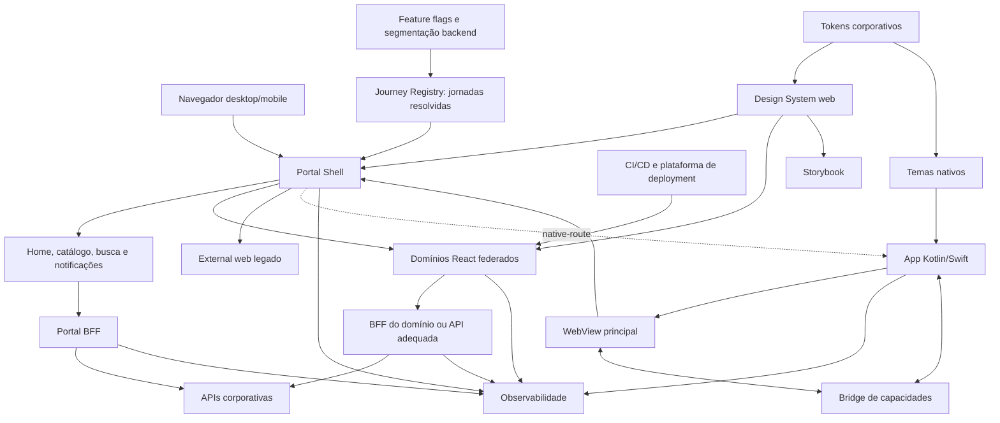
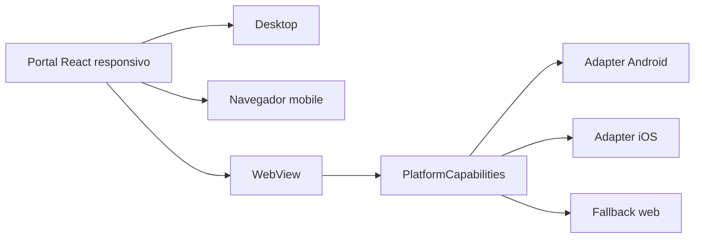
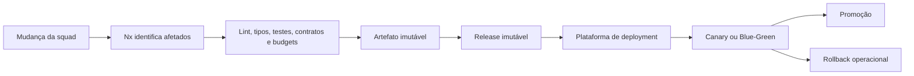
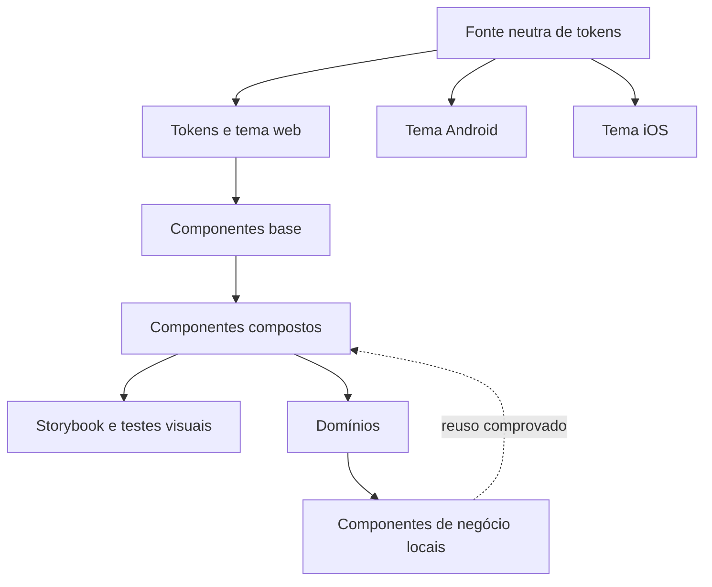
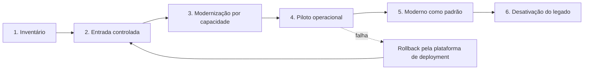
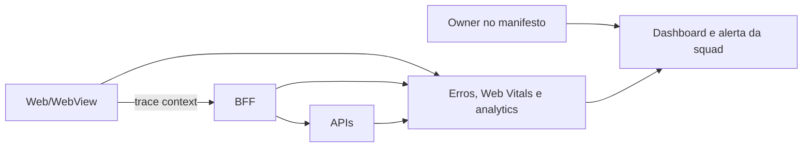

# Proposta Técnica — Próxima Geração do Portal Pessoas

## Resumo executivo

A proposta combina um **monorepo do frontend moderno** com **microfrontends coarse-grained carregados em runtime**, um **shell deliberadamente fino**, um **aplicativo nativo mínimo com WebView e bridge controlada**, e um **registro dinâmico de destinos** capaz de direcionar cada capacidade para uma experiência moderna, externa ou nativa.

A escolha busca preservar o principal requisito do cenário — autonomia sustentável para mais de 10 squads — sem repetir os problemas comuns de ecossistemas de microfrontends: fragmentação excessiva, dependências invisíveis, múltiplos padrões, degradação de performance e transformação do shell em gargalo.

Os princípios que orientam a proposta são:

1. autonomia de entrega exige fronteiras de ownership e operação, não somente separação de código;
2. o shell compõe experiências, mas não concentra regras de negócio;
3. aplicações legadas convivem por integração, sem serem artificialmente movidas para o monorepo;
4. compartilhamento é seletivo: contratos e linguagem visual são comuns, estado e regras permanecem locais;
5. governança deve ser automatizada pelo golden path e pelos gates do workspace;
6. migração é gradual e reversível; rollout e rollback são operados pelo CI/CD e pela plataforma de deployment.

---

## 1. Arquitetura de alto nível

### Responsabilidades

| Elemento | Responsável por | Não responsável por |
|---|---|---|
| Shell | bootstrap, navegação, descoberta, composição, contexto, loading, fallback e telemetria transversal | regras de negócio, audiência, release, percentual, promoção ou rollback |
| Domínio moderno | rotas internas, UI, estado, regras de apresentação, integrações, testes, release e operação | outros domínios ou internals do shell |
| Journey Registry | jornadas autorizadas e destinos já resolvidos, com versão técnica, contrato, ownership e observabilidade | decidir release no frontend ou classificar permanentemente moderno e legado |
| Portal BFF | home, catálogo, busca e notificações | orquestrar todos os domínios |
| BFF de domínio | agregação e adaptação justificadas pela experiência | autorização apenas no frontend ou lógica visual |
| App nativo | sessão, ciclo de vida, deep links, push, permissões, WebView e capacidades do dispositivo | regras das jornadas web |
| Design System | linguagem visual, tokens, componentes e documentação | componentes com regras específicas de um domínio |

### Contrato de extensão

Uma nova jornada não exige alteração no código do shell. A squad publica um artefato imutável e registra um destino compatível com uma das estratégias:

- `federated-module`: domínio React carregado em runtime;
- `external-web`: experiência incompatível ou ainda não modernizada;
- `native-route`: funcionalidade pertencente ao aplicativo nativo.

O registro informa, no mínimo, identificador, rota, destino já resolvido, versão técnica do artefato, faixa compatível do contrato da plataforma, owner e observabilidade. O shell valida o manifesto e fornece somente o contrato de capacidades aprovado; ele não interpreta público, percentual ou canal de release.

### Isolamento de falhas

Cada remote é carregado sob `Suspense`, timeout e fronteira de erro. Indisponibilidade, incompatibilidade ou falha de renderização resultam em fallback consistente, retry limitado e retorno seguro, sem desmontar o shell ou afetar outros domínios.

---

## 2. Estratégia web + mobile

### Abordagem escolhida

O aplicativo Kotlin/Swift mantém uma camada nativa mínima e uma WebView principal duradoura. A mesma aplicação React responsiva atende navegador desktop, navegador mobile e WebView.

### O que permanece nativo

- autenticação e estabelecimento seguro da sessão web;
- ciclo de vida do aplicativo e da WebView;
- deep links e push notifications;
- navegação de entrada, saída e retorno;
- câmera, seleção de arquivos, compartilhamento e download;
- biometria e armazenamento seguro;
- telemetria de aplicativo e dispositivo;
- experiências nativas já existentes ou que exijam forte integração com o dispositivo.

### O que é compartilhado

- aplicação React e jornadas responsivas;
- componentes do Design System web;
- contratos TypeScript e schemas;
- clientes HTTP e regras de apresentação;
- padrões de loading, erro, analytics e acessibilidade;
- tokens semânticos, mas não necessariamente o código dos componentes nativos.

### Bridge mínima e versionada

A bridge expõe comandos permitidos, tipados, assíncronos e versionados. Deve possuir negociação de capacidades, validação de origem e payload, timeout, resposta padronizada e fallback para versões antigas do aplicativo.

Ela não substitui BFFs, não executa métodos arbitrários, não transporta objetos de negócio e não entrega tokens nativos ao JavaScript.

### Alternativas consideradas

| Opção | Benefício | Limitação | Decisão |
|---|---|---|---|
| WebView + camada nativa mínima | maior reuso real e atualização independente das lojas | menor fidelidade nativa em alguns fluxos | escolhida como padrão |
| React Native | UI mais próxima do nativo e compartilhamento entre Android/iOS | não reutiliza diretamente componentes React DOM e adiciona runtime móvel | não adotado agora |
| PWA | distribuição simples e alto reuso web | integração limitada com aplicativo corporativo e dispositivo | complementar, não principal |
| Kotlin/Swift por jornada | melhor integração e comportamento nativo | maior duplicação e cadências distintas | reservado a necessidades justificadas |

---

## 3. Estratégia para múltiplas squads

### Monorepo com autonomia operacional

O monorepo contém somente o frontend moderno. Shell, remotes React, contratos da plataforma, Design System web e ferramentas de workspace convivem no mesmo grafo, mas cada domínio continua sendo uma unidade independente de código e build. Publicação, rollout e rollback são executados externamente pelos pipelines e pela plataforma de deployment.

Aplicações legadas permanecem nos repositórios atuais até serem substituídas. Colocá-las no monorepo sem modernização apenas transferiria dívida e dependências incompatíveis para o novo baseline.

### Fluxo de entrega

### Ownership

Cada squad de domínio possui código, manifesto, pipeline, dashboards, alertas, incidentes e responsabilidade operacional pela release. A Plataforma Frontend mantém shell, contrato, runtime de composição, generators, configurações-base e regras de fronteira. A plataforma backend mantém o Journey Registry; CI/CD e deployment executam publicação, promoção e rollback.

O Chapter Frontend governa mudanças transversais; ele não aprova manualmente cada release de domínio.

### Golden path

O generator de domínio fornece estrutura, manifesto, integração, telemetria, testes e pipeline padrão. As regras se dividem em:

1. **obrigatórias:** fronteiras, contrato, segurança, observabilidade, acessibilidade e qualidade mínima;
2. **recomendadas:** organização interna e stack do golden path;
3. **excepcionais:** divergências justificadas por ADR, com owner e condição de revisão.

Nx e ESLint impedem imports entre domínios, imports de internals do shell e dependências não autorizadas. Mudanças em configurações de raiz ou singletons exigem revisão da plataforma.

### Versionamento

| Elemento | Estratégia |
|---|---|
| Remote | artefato imutável com versão ou build identificável |
| Journey Registry | entrega o destino autorizado já resolvido para a sessão |
| Contrato da plataforma | versionamento semântico e faixa de compatibilidade |
| APIs/BFFs | contrato versionado, preferencialmente OpenAPI |
| Libraries compartilhadas | evolução compatível e janela de depreciação |
| React, React DOM e React Router | singletons coordenados pela plataforma |

TanStack Query, React Hook Form, Zod, Zustand e Design System não são disponibilizados pelo shell. São dependências compiladas pelo domínio que as utiliza, ainda que o workspace controle versões recomendadas.

### IA como apoio à governança

Após arquitetura e golden path estabilizados, skills locais podem orientar implementação e revisar aderência ao `SPEC.md` e ao `ARCHITECTURE.md`. IA complementa regras determinísticas e revisão humana; não é o único gate.

---

## 4. Estratégia de microfrontends e monorepo

### Decisão

As jornadas modernas são microfrontends React coarse-grained, compostos por rota com Module Federation Runtime. Nx e pnpm organizam o monorepo; Vite realiza desenvolvimento e build.

Somente React, React DOM e React Router são singletons obrigatórios. Não existem widgets federados pequenos, imports remote-to-remote ou estado global de negócio.

### Comparação de composição

| Alternativa | Autonomia | Performance | Governança | Complexidade | Avaliação |
|---|---|---|---|---|---|
| SPA modular com único deploy | baixa/média | melhor baseline inicial | simples | baixa | não atende a cadências independentes |
| Packages versionados em build-time | média | boa | risco de upgrade coordenado | média | útil para libraries, insuficiente para jornadas |
| Module Federation por domínio | alta | controlável com granularidade coarse | exige contratos e runtime governado | média/alta | escolhida |
| Single-SPA multi-framework | alta | depende de cada aplicação | amplia combinações suportadas | alta | legado temporário não justifica o orquestrador |
| Web Components | média/alta | isolamento com custo de adapters | contratos de DOM claros | média/alta | útil para widgets, não para rotas React completas |
| Iframes | alta no deploy | custo e experiência fragmentada | forte isolamento | alta na integração | inadequado como padrão |

### Comparação de repositórios

| Modelo | Benefício | Risco | Avaliação |
|---|---|---|---|
| Polyrepo | isolamento administrativo | drift de tooling, contratos e dependências | rejeitado para o frontend moderno |
| Monorepo único incluindo legado | visibilidade central | contamina o baseline e cria migração artificial | rejeitado |
| Monorepo do moderno + legado externo | grafo e governança comuns sem importar dívida | exige integração runtime e disciplina de ownership | escolhido |

### Por que não Next.js

O portal é autenticado, não depende de SEO e não possui requisito de SSR. Um BFF no mesmo domínio poderia ser construído com Next.js, mas isso acoplaria lifecycle do BFF ao frontend e não elimina a necessidade de ownership backend. A baseline permanece CSR; um domínio com necessidade comprovada de Next.js é integrado como `external-web`.

### Controles de performance

- um remote por domínio ou rota relevante;
- lazy loading e prefetch somente orientado por intenção;
- budgets por remote e medição de Web Vitals;
- mínimo de singletons e bibliotecas runtime compartilhadas;
- cache HTTP de artefatos imutáveis;
- timeout, fallback e telemetria de carregamento;
- proibição de WebViews aninhadas e de pequenos widgets federados.

### Estado e comunicação

O shell compartilha somente `PlatformCapabilities`: navegação, contexto mínimo, telemetria, flags resolvidas, notificações e capacidades de dispositivo. Cada domínio mantém seu próprio estado e `QueryClient`. Transições de negócio usam URL, identificador opaco ou backend; não existe barramento global genérico.

---

## 5. Design System

### Estrutura

### Camadas

- **tokens:** cores, tipografia, espaçamento, bordas, elevação e movimento com nomes semânticos;
- **componentes base:** botão, campo, texto, ícone, feedback e superfície;
- **componentes compostos:** modal, cabeçalho, navegação, tabela, formulário e busca;
- **padrões de experiência:** loading, vazio, erro, confirmação e responsividade;
- **componentes de negócio:** permanecem no domínio até que haja reuso comprovado.

### Web, Android e iOS

O Design System corporativo mantém a fonte neutra e publica artefatos por plataforma. Web, Android e iOS consomem a mesma semântica, mas cada arquitetura implementa seus próprios componentes.

No case, `libs/design-tokens/` e `libs/design-system-web/` simulam os pacotes externos. Essa simplificação preserva a fronteira e evita um segundo repositório artificial.

### Storybook

`apps/design-system-docs/` documenta tokens e componentes do DS web no case. Na arquitetura-alvo, o Storybook pertence ao repositório do Design System corporativo.

Cada componente promovido deve documentar variações, propriedades, estados, temas, responsividade, acessibilidade, testes de interação e referências de regressão visual. O Storybook é publicado como artefato estático independente do shell.

### Estilos

CSS Custom Properties materializam tokens em runtime; CSS Modules com SCSS fornecem escopo, nesting e ergonomia sem runtime de CSS-in-JS. Tailwind e styled-components são exceções, pois ampliariam liberdade visual ou dependências runtime sem requisito atual.

### Governança e adoção

Mudanças compatíveis seguem versionamento semântico. Breaking changes exigem RFC, período de depreciação, documentação e suporte de migração. Squads contribuem por pull request; a equipe de Design System mantém critérios de acessibilidade, consistência e promoção.

---

## 6. Estratégia de migração

### Migração por capacidade

A unidade de migração é uma capacidade ou fluxo, não necessariamente a aplicação legada inteira. Uma jornada pode combinar temporariamente subrotas modernas e externas.

### Entrada e retorno do legado

Ao resolver um destino `external-web`, o portal valida a allowlist, registra a transição, preserva uma rota autorizada de retorno e cria correlação. SSO estabelece a sessão; tokens, matrícula e dados pessoais não são enviados pela URL.

No aplicativo, somente origens modernas autorizadas recebem bridge. Páginas legadas são abertas na modalidade definida pelo registro e mantêm retorno pelo aplicativo ou portal.

### Rollout e rollback

O CI/CD gera e publica releases imutáveis. A plataforma de deployment aplica Canary ou Blue-Green, controla tráfego, promoção e rollback. Quando a migração exigir público específico, feature flags ou serviços backend resolvem elegibilidade e autorização antes da resposta ao frontend.

O Journey Registry pode consumir essas decisões externas e entrega ao shell somente o destino já resolvido. O navegador não seleciona versão, público ou percentual, e o monorepo não contém canais candidate/stable nem mecanismos operacionais de rollback.

### Indicadores de avanço

- percentual de tráfego moderno;
- capacidades migradas ponderadas por uso e criticidade;
- conclusão e abandono;
- erros, latência e Web Vitals;
- uso de fallback;
- incidentes e chamados;
- dependências restantes no legado.

Uma capacidade só é desligada quando alcança o público previsto, atende aos critérios funcionais e SLOs, permanece estável pela janela acordada e não possui referências ativas no portal.

---

## Observabilidade transversal

O shell inicializa o contexto de correlação e fornece um contrato pequeno. Cada domínio emite logs estruturados, erros, métricas de performance e analytics com identificador do domínio, versão, rota e plataforma. Sinais operacionais de rollout pertencem à plataforma de deployment.

O frontend usa uma abstração desacoplada do fornecedor; BFFs e APIs podem usar OpenTelemetry. A telemetria não contém salário, documentos, tokens ou dados pessoais sensíveis.

Ownership operacional:

- shell, registro e runtime: Plataforma Frontend;
- remote e experiência: squad do domínio;
- BFF e APIs: respectivos times backend;
- bridge e WebView: times Android/iOS.

---

## Baseline técnica

| Preocupação | Escolha |
|---|---|
| Frontend | React, TypeScript e CSR |
| Workspace | Nx e pnpm |
| Build | Vite |
| Composição | Module Federation Runtime |
| Rotas | React Router hierárquico |
| Dados | `fetch`, cliente por domínio e TanStack Query |
| Estado cliente | React; Zustand quando necessário |
| Formulários | React Hook Form e Zod |
| Estilos | CSS Modules, SCSS e CSS Custom Properties |
| Design System | tokens externos, DS web e Storybook |
| Testes | Vitest, Testing Library, MSW e Playwright |
| Observabilidade | contrato próprio, W3C Trace Context e integração corporativa |

## Principais riscos e mitigadores

| Risco | Mitigação |
|---|---|
| muitos remotes degradarem carregamento | granularidade por domínio, budgets, lazy loading e telemetria |
| shell virar gargalo | registro dinâmico, contrato pequeno e onboarding self-service |
| monorepo virar monólito | projetos afetados, deploy independente, ownership e fronteiras Nx |
| versões divergentes | poucos singletons, contrato semântico e artefatos imutáveis |
| inconsistência entre squads | golden path, DS, Storybook e gates automatizados |
| bridge ampliar superfície de ataque | allowlist, schemas, capacidades mínimas e sessão sem token no JS |
| migração nunca terminar | scorecard por tráfego/criticidade e critérios de desativação |
| IA validar incorretamente | lint, schemas, testes e revisão humana permanecem autoritativos |

## Perguntas esperadas e defesa das decisões

### “Monorepo não impede deploy independente?”

Não. Repositório, build e deploy são dimensões diferentes. Nx calcula projetos afetados; cada remote produz artefato e release próprios. O registro controla qual versão é carregada.

### “Por que usar microfrontends se eles já causaram problemas?”

Os problemas são tratados como restrições: remotes grandes por domínio, poucos singletons, ausência de imports entre remotes, contrato mínimo, budgets e observabilidade. A escala de 10+ squads justifica a complexidade residual.

### “Por que não colocar o legado no monorepo?”

Porque localização não moderniza dependências. React antigo e Angular continuam externos até uma migração orientada a valor. Isso evita contaminar o baseline e permite convivência sem big bang.

### “Por que não Next.js para BFF?”

SSR e SEO não são requisitos. O BFF é uma fronteira backend e deve ter lifecycle próprio. Next.js permanece permitido para um domínio externo que possua necessidade concreta.

### “Por que não compartilhar todas as dependências pelo shell?”

Isso transformaria recomendações em acoplamento runtime. Somente React, React DOM e React Router precisam compartilhar identidade. As demais dependências são controladas pelo workspace e compiladas por domínio.

### “Design System único significa o mesmo componente em todas as plataformas?”

Não. Significa tokens, princípios e governança comuns. React, Android e iOS implementam componentes adequados a cada runtime.

### “A bridge não é um novo backend?”

Não. Ela expõe capacidades do dispositivo. APIs, regras e dados continuam em BFFs e serviços. A bridge é pequena, versionada e bloqueada para origens não autorizadas.

### “Como a plataforma não se torna um novo gargalo?”

Ela mantém contratos, generators e regras automatizadas. Releases rotineiros pertencem às squads; somente mudanças transversais exigem governança compartilhada.

## Matriz de cobertura da Parte 1

| Entregável do case | Resposta na proposta |
|---|---|
| Arquitetura de alto nível | Seção 1: shell, remotes, app móvel, bridge, BFFs, APIs, Design System, observabilidade e destinos legados no mesmo desenho. |
| Estratégia web + mobile | Seção 2: responsabilidades nativas, reuso via React responsivo e WebView, bridge mínima, consistência por tokens e comparação com PWA, React Native e interfaces totalmente nativas. |
| Múltiplas squads | Seção 3: código e builds independentes, publicação e rollback por plataformas externas, Nx affected, CODEOWNERS, ownership operacional, versionamento, golden path, gates e governança federada. |
| Microfrontends ou alternativa | Seção 4: decisão por Module Federation coarse-grained e comparação explícita com SPA única, packages, Single-SPA, Web Components, iframes, polyrepo e monorepo com legado. |
| Design System | Seção 5: tokens, componentes base e compostos, componentes de negócio, artefatos por plataforma, Storybook, versionamento, governança e adoção. |
| Migração | Seção 6: convivência com legado, substituição por capacidade, redirecionamento controlado, rollout, rollback, métricas de avanço e critérios de desativação. |

## Escopo da Parte 1 e próximo passo

Esta proposta define arquitetura, responsabilidades, integração, governança, trade-offs e migração. Não executa infraestrutura, deploy, backend, aplicativo nativo ou migração real.

Após aprovação da Parte 1, a Parte 2 deve selecionar um incremento demonstrável que prove os pontos de maior risco: shell, dois domínios independentes, registro, carregamento federado, Design System, fallback e integração legada simulada.

## Referências

- [Nx — Module Federation e deploy independente](https://nx.dev/docs/technologies/module-federation/concepts/module-federation-and-nx)
- [Nx — fronteiras entre módulos](https://nx.dev/docs/guides/enforce-module-boundaries)
- [Module Federation](https://module-federation.io/)
- [Android — WebView e integração com conteúdo web](https://developer.android.com/develop/ui/views/layout/webapps/webview)
- [Android — riscos de bridges nativas](https://developer.android.com/privacy-and-security/risks/insecure-webview-native-bridges)
- [Design Tokens Community Group — formato estável](https://www.w3.org/community/reports/design-tokens/CG-FINAL-format-20251028/)
- [OpenTelemetry JavaScript](https://opentelemetry.io/docs/languages/js/)
- [OpenFeature — Evaluation Context](https://openfeature.dev/specification/sections/evaluation-context/)
- [AWS — Strangler Fig Pattern](https://docs.aws.amazon.com/prescriptive-guidance/latest/cloud-design-patterns/strangler-fig.html)
